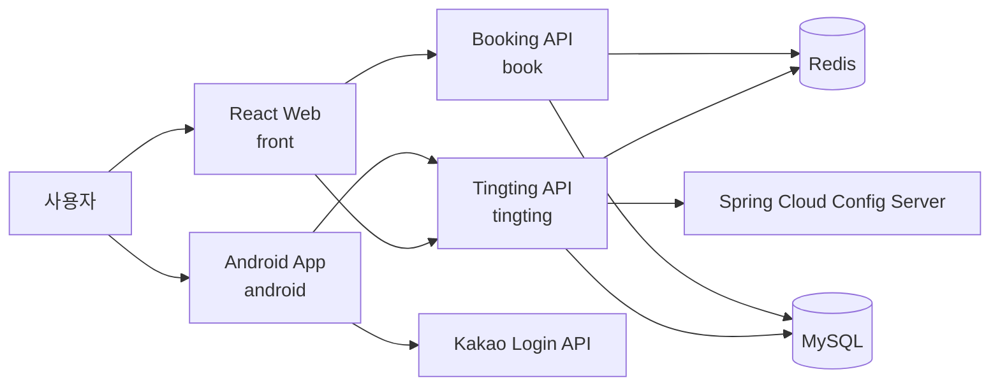
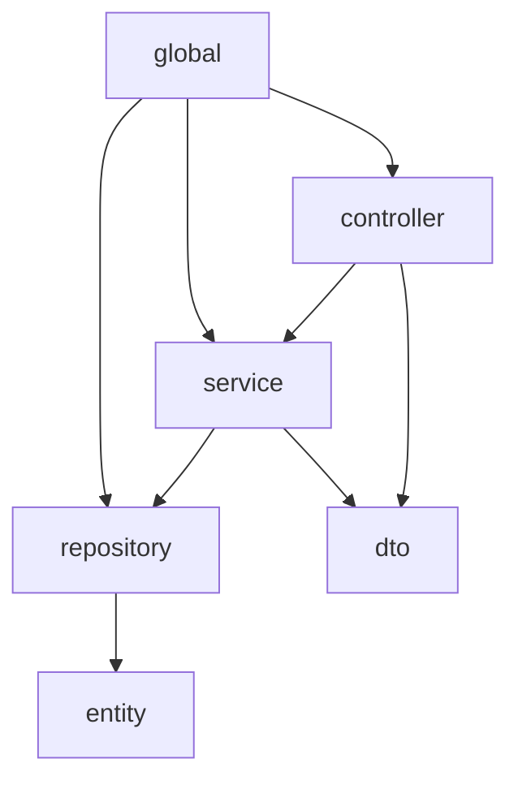

<div align="center">
  

  ### 티켓팅 시뮬레이션 서비스
</div>

## 프로젝트 개요

팅팅은 티켓팅 과정을 연습할 수 있는 시뮬레이션 서비스입니다. 웹, Android, Spring Boot 백엔드로 구성되어 있으며
예매 트래픽이 집중되는 상황을 고려해 Redis와 MySQL을 함께 사용합니다.

## 기간

- 2023.10.10 ~ 2023.11.17 (총 6주)

## 참여 인원

| 이름  | 역할                    |
|-----|-----------------------|
| 이찬희 | Backend & Team Leader |
| 장중원 | Backend               |
| 이호찬 | Backend               |
| 이효진 | Backend               |
| 김희웅 | Android               |
| 구본재 | Frontend              |

## 목차

1. [서비스 소개](#서비스-소개)
2. [저장소 구조](#저장소-구조)
3. [실행 방법](#실행-방법)
4. [아키텍처 다이어그램](#아키텍처-다이어그램)
5. [기술 스택](#기술-스택)
6. [데이터 구조](#데이터-구조)
7. [ADR](#adr)
8. [기존 서비스 화면](#기존-서비스-화면)

## 서비스 소개

- 사용자는 공연 목록을 조회하고 상세 정보를 확인할 수 있습니다.
- 좌석 구역과 좌석 상태를 보면서 예매 시뮬레이션을 진행할 수 있습니다.
- 웹과 Android 클라이언트가 동일한 도메인 모델을 공유하도록 API가 구성돼 있습니다.

## 저장소 구조

| 경로          | 설명                                                    |
|-------------|-------------------------------------------------------|
| `front/`    | React + Vite 웹 클라이언트                                  |
| `android/`  | Kotlin Android 앱                                      |
| `book/`     | 로컬 개발에 적합한 Spring Boot 예매 백엔드                         |
| `tingting/` | Swagger, Actuator, Prometheus를 포함한 Spring Boot API 서버 |
| `docs/adr/` | 기술 결정 문서(Architecture Decision Record)                |

## 실행 방법

### 공통 요구사항

- Java 11
- Node.js 및 npm
- MySQL
- Redis
- Android Studio (Android 앱 실행 시)

### 1. Backend `book` 모듈 실행

`book` 모듈은 로컬 프로필이 포함되어 있어 가장 빠르게 실행할 수 있는 백엔드입니다.

1. MySQL에 `tingting_book` 데이터베이스를 생성합니다.
2. Redis를 `127.0.0.1:6379`에서 실행합니다.
3. 아래 명령으로 애플리케이션을 실행합니다.

```bash
cd book
./gradlew bootRun
```

기본 포트는 `8080`입니다. 로컬 설정은 [application-local.yml](book/src/main/resources/application-local.yml) 에 있습니다.

### 2. Backend `tingting` 모듈 실행

`tingting` 모듈은 Swagger, Actuator, Prometheus 설정이 포함된 API 서버입니다. 현재 저장소에는 로컬 프로필이 없고
외부 Config Server(`http://k9d209.p.ssafy.io:8888`) 설정을 참조합니다.

```bash
cd tingting
./gradlew bootRun
```

- 기본 포트는 `9000`입니다.
- 실행 전 Config Server, MySQL, Redis 설정이 준비되어 있어야 합니다.

### 3. Web `front` 모듈 실행

```bash
cd front
npm install
npm run dev
```

- 기본 개발 서버는 Vite 표준 포트(`5173`)를 사용합니다.
- 현재 웹 클라이언트의 API 기본 주소는 [front/src/constants/index.ts](front/src/constants/index.ts) 에서 `https://k9d209.p.ssafy.io/api` 로 고정돼 있습니다.
- 로컬 백엔드와 연동하려면 같은 파일의 API 주소를 로컬 서버 주소로 변경해야 합니다.

### 4. Android 앱 실행

Android 앱은 `local.properties` 에 `api_key`, `base_url` 값을 요구합니다.

```properties
api_key=YOUR_KAKAO_API_KEY
base_url=https://your-api-host/
```

실행 절차:

1. Android Studio로 `android/` 디렉터리를 엽니다.
2. `local.properties` 를 준비합니다.
3. 에뮬레이터 또는 실제 기기에서 실행합니다.

## 아키텍처 다이어그램



### 백엔드 패키지 구조



- 도메인별로 `book`, `concert`, `user` 패키지가 분리돼 있습니다.
- 공통 인프라는 `global/` 아래에 배치돼 있습니다.

## 기술 스택

### Android


### Frontend


### Backend


### Communication


## 데이터 구조


## ADR

기술 결정 문서는 `docs/adr` 디렉터리에서 관리합니다.

- [ADR-0001: Multi-Module Runtime Structure](docs/adr/0001-multi-module-runtime-structure.md)
- [ADR-0002: Redis for Reservation Hot Path](docs/adr/0002-redis-for-reservation-hot-path.md)

## 기존 서비스 화면

|  |  |  |
|-------------------------------------------------------------------------------------------------|-------------------------------------------------------------------------------------------------|-------------------------------------------------------------------------------------------------|
|  |  |                                                                                                 |
